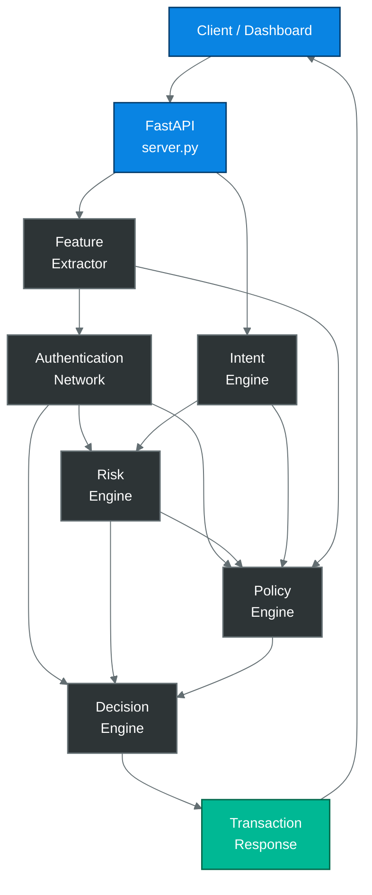

# NeuralAuth

**AI-powered multi-modal transaction authentication engine**

Explainable, policy-aware, production-hardened transaction authentication.


---

## Table of Contents

- [NeuralAuth](#neuralauth)
  - [Table of Contents](#table-of-contents)
  - [Overview](#overview)
  - [Architecture](#architecture)
  - [Request Lifecycle](#request-lifecycle)
  - [Core Components](#core-components)
  - [Decision Engine](#decision-engine)
  - [Repository Structure](#repository-structure)
  - [Getting Started](#getting-started)
  - [Configuration](#configuration)
  - [Security](#security)
  - [Testing](#testing)
  - [Milestones](#milestones)
  - [Tech Stack](#tech-stack)
  - [Known Limitations \& Roadmap](#known-limitations--roadmap)
  - [Contributing](#contributing)
  - [License](#license)

---

## Overview

NeuralAuth authenticates financial transactions in real time by combining a multi-task deep neural network, an LLM-backed intent parser, a deterministic risk engine, a YAML-driven policy engine, and a pluggable decision-fusion layer — all behind a single FastAPI endpoint.

Every stage produces a typed, explainable output that feeds a full audit trail: the exact feature values that fed the model, the model's own attribution scores, which policy rules matched, and which fusion strategy produced the final action. Nothing is a black box.

**Key characteristics**

| | |
|---|---|
| Model | Multi-task neural network — trust / risk / decision / confidence heads |
| Intent | LLM-backed, schema-validated, retrying |
| Policy | YAML-driven, hot-reloadable, 11 rules |
| Fusion | 6 pluggable strategies (majority, weighted, Bayesian, risk-first, policy-first, risk-weighted default) |
| Audit | Full feature vector + model attributions + rule trace on every response |
| Startup | Eager model loading, fail-fast, thread-safe singletons |
| Tests | 158 automated tests (unit, integration, concurrency, security, validation) |

---

## Architecture



- `api/server.py` — FastAPI app, lifespan startup, `/authenticate` route, opt-in API-key auth
- `engines/feature_extractor.py` — raw request → 31-field `FeatureVector`, deterministic and ML-free
- `inference/predictor.py` — `AuthenticationNetwork` inference (thread-safe singleton)
- `engines/intent_engine.py` — LLM-backed transcript parsing into a structured `Transaction`
- `engines/risk_engine.py` — standardizes the network's risk score into a leveled, auditable breakdown
- `engines/policy_engine.py` — deterministic YAML rules (`rules/policy_rules.yaml`), hot-reloadable
- `engines/decision/` — fuses AI + policy recommendations into one explainable, audited action

Verified as a clean dependency DAG: `models/`, `config/` → `engines/` → `inference/` → `api/`, with no circular imports and no upward dependency from the business/ML layer into the web layer.

---

## Request Lifecycle

1. `POST /authenticate` arrives with a `TransactionRequest` JSON body.
2. **Validation** — Pydantic rejects blank `user_id`/`transcript`, out-of-range GPS, negative speed, or malformed timestamps with `422` before any engine runs.
3. **Auth gate** — if `TRANSACTION_ENGINE_API_KEY` is set, the `X-API-Key` header must match or the request is rejected with `401`.
4. **Feature extraction** builds the 31-field `FeatureVector`.
5. **Authentication Network** (pre-warmed singleton) produces trust / risk / confidence / decision-probability signals.
6. **Intent Engine** parses the voice transcript into a structured `Transaction`.
7. **Risk Engine** turns the network's risk score into a leveled, explainable assessment.
8. **Policy Engine** evaluates deterministic YAML rules against everything gathered so far, including real request-derived `location_familiarity`, `time_familiarity`, `previous_trust_score`, and `failed_attempts`.
9. **Decision Engine** fuses the AI and policy recommendations (policy's `CRITICAL` priority unconditionally wins), builds the full audit trail, and returns one final action.
10. **Response** is serialized back to the client; any unhandled exception is logged in full server-side and returned to the client only as a generic message plus a `request_id`.

**Startup:** the FastAPI `lifespan` eagerly loads every engine (predictor, intent, risk, policy, decision) before accepting traffic. Any loader failure aborts startup — the process never serves with a partially-loaded model. Each loader is double-checked-locked, so concurrent callers can never construct more than one instance. In a real run: ~4.7s startup, ~4ms first request.

---

## Core Components

**Authentication Network** (`engines/authentication_network.py`)
`FeatureVector → FeatureAttention → ProjectionLayer → ResidualEncoder → shared embedding → {Trust, Risk, Decision, Confidence} heads`. Also hosts the training loop, checkpoint I/O, an `ExperimentLogger`, MC-dropout utilities, and a `DeepEnsemble`.

**Feature Extraction** (`engines/feature_extractor.py`, `models/feature_vector.py`)
Deterministic, ML-free transformation of a raw request into the 31-field `FeatureVector`: identity (5), biometrics (4), behavior (5), vehicle (6), history (4), transaction (4), intent (2), risk (1).

**Inference** (`inference/predictor.py`)
`AuthenticationPredictor` loads and cross-validates six on-disk artifacts once, then exposes `preprocess()` / `predict()` / `predict_result()` as separate steps. Thread-safe lazy singleton via `get_predictor()`.

**Intent Engine** (`engines/intent_engine.py`)
Wraps an LLM (HF pipeline, LIGHT/HEAVY backend via `config/intent/config.yaml`) with prompt construction, JSON-schema validation, retry-on-failure, and beneficiary SAVED/NEW/UNKNOWN classification.

**Risk Engine** (`engines/risk_engine.py`)
Standardizes the network's risk score into `overall_risk`, `risk_level`, and an auditable `breakdown` (voice, behavior, location, device, transaction risk) — deliberately produces no recommended action of its own.

**Policy Context** (`engines/policy_context.py`)
Bridges continuous `FeatureVector` scores into the categorical labels the Policy Engine's rules key off of (`location_familiarity`, `time_familiarity`), with configurable thresholds.

**Policy Engine** (`engines/policy_engine.py`, `rules/policy_rules.yaml`)
Deterministic, hot-reloadable, YAML-driven rule evaluation. Every rule is a declarative `when: {field_op: value}` block; conflicts resolve by priority then action severity.

**Dashboard** (`dashboard.py`, launched by `app.py`)
A NiceGUI visualization client that talks to the API exclusively over HTTP — no business logic of its own.

---

## Decision Engine

`engines/decision/` is a package, each module with one responsibility:

| Module | Responsibility |
|---|---|
| `decision_engine.py` | Orchestration only — calls everything below in order |
| `config.py` | Thresholds and source weights, externalizable via YAML |
| `fusion.py` | Strategies: MajorityVoting, WeightedVoting, RiskWeightedFusion (default), BayesianFusion, RiskFirst, PolicyFirst |
| `explanation.py` | `top_reasons()` / `top_contributors()` — model attributions |
| `audit.py` | `decision_trace`, `decision_graph`, full `feature_vector`, `rule_trace` |
| `metadata.py` | `request_id`, `decision_trace_id`, model & policy versions |
| `history.py` | `InMemoryHistoryStore` — per-user recent-action recall |
| `metrics.py` | Decision counters for monitoring |
| `hooks.py` | `before/after_fusion`, `before/after_audit` extension points |
| `ensemble.py` | Merges multiple `AuthenticationResult`s |
| `numeric.py` / `serializers.py` | Tensor → plain Python, JSON serialization |
| `types.py` | `DecisionAction`, `DecisionResult`, `PolicyPriority`, `Severity` |

`DecisionEngine.decide(authentication, risk, policy, intent=None, transaction=None, features=None, ...)` fuses the AI vote and the policy vote (plus any `additional_recommendations`) via the configured strategy, builds `top_reasons` and `top_attributions`, and assembles the full audit trail — including the complete 31-field `feature_vector` under `audit_log["feature_vector"]`.

---

## Repository Structure

```text
Transaction_engine/
│
├── api/
│   └── server.py                 FastAPI app: lifespan, auth dependency, /authenticate route
│
├── engines/
│   ├── authentication_network.py Model architecture + training loop + checkpoint I/O
│   ├── feature_extractor.py      Raw request → FeatureVector (31 fields)
│   ├── intent_engine.py          LLM-backed transcript → Transaction
│   ├── risk_engine.py            Risk standardization + breakdown
│   ├── policy_engine.py          YAML-driven deterministic rules
│   ├── policy_context.py         FeatureVector scores → policy categorical labels
│   └── decision/                 Fusion, audit, explanation, metadata, history, metrics, hooks
│
├── inference/
│   └── predictor.py               AuthenticationPredictor (artifact loading + inference)
│
├── models/
│   ├── request.py                 TransactionRequest (validated Pydantic model)
│   ├── response.py                TransactionResponse
│   ├── feature_vector.py          FeatureVector dataclass (31 fields)
│   └── prediction.py              Prediction / AuthenticationResult contracts
│
├── config/
│   ├── auth/config.yaml           Authentication Network hyperparameters
│   └── intent/config.py+.yaml     Intent Engine config (LIGHT/HEAVY backend selection)
│
├── rules/
│   └── policy_rules.yaml          Live, hot-reloadable Policy Engine rules
│
├── training/                       Independent offline pipeline: dataset generation,
│                                    LLM-based labeling/verification, train.py, evaluate.py
│
├── scripts/
│   └── smoke_test_qwen.py          Manual model smoke test (not a pytest test)
│
├── tests/                           158 tests: unit, integration, concurrency, security, validation
│
├── dashboard.py                    NiceGUI visualization client (HTTP-only, no business logic)
├── app.py                          Launches API (background thread) + dashboard together
├── .env.example                    Documented environment variables (no real secrets)
├── .gitignore                      Excludes secrets, caches, venvs, model artifacts
├── requirements.txt
└── README.md
```

---

## Getting Started

```bash
# 1. Create and activate a virtual environment
python3 -m venv .venv
source .venv/bin/activate

# 2. Install dependencies
pip install -r requirements.txt

# 3. Configure environment (optional — needed for the LLM-based
#    training/labeling pipeline, and for enabling API-key auth)
cp .env.example .env

# 4. Run the API standalone
python api/server.py
# → serves on http://127.0.0.1:8000 (GET /, GET /health, POST /authenticate)

# 5. Or run the API + dashboard together
python app.py
```

The FastAPI `lifespan` loads every model/engine before the server starts accepting traffic — expect a multi-second startup (dominated by the Authentication Network checkpoint and the Intent Engine's LLM) rather than a slow first request.

---

## Configuration

| File | Loaded by | Purpose |
|---|---|---|
| `config/auth/config.yaml` | `ModelConfig.from_yaml()` | Authentication Network architecture/training hyperparameters |
| `config/intent/config.yaml` | `load_config()` | Intent Engine backend (LIGHT/HEAVY), retries, validation limits |
| `rules/policy_rules.yaml` | `PolicyEngine.load_rules()` | Live, hot-reloadable rules (`reload_yaml()` — no restart needed) |
| `.env` (from `.env.example`) | `training/config.py` (dotenv) | LLM provider key for offline training; `TRANSACTION_ENGINE_API_KEY` for API auth |

---

## Security

- **Authentication** — `POST /authenticate` is gated by an opt-in `X-API-Key` check, enforced only when `TRANSACTION_ENGINE_API_KEY` is set. A startup warning is logged if it's left unset. `GET /` and `GET /health` stay open for health checks.
- **No internal detail leakage** — unhandled exceptions are logged in full server-side and returned to clients only as a generic message plus an opaque `request_id`, never `str(exception)`.
- **Input validation** — GPS bounds, non-negative speed, non-blank `user_id`/`transcript`, ISO-8601 timestamps; malformed input fails cleanly with `422`.
- **Secrets hygiene** — `.gitignore` excludes `.env`, model artifacts, and caches; `.env.example` documents required variables without real values.
- **Safe deserialization** — all YAML loading uses `yaml.safe_load`; no `eval`/`exec`/`subprocess`/`shell=True` anywhere in the codebase.
- **Thread-safe model loading** — every lazy singleton uses double-checked locking, verified under a 32-thread concurrency test.

See [Known Limitations](#known-limitations--roadmap) for security items identified but intentionally deferred.

---

## Testing

```bash
pytest                                        # full suite — 158 tests, ~25-30s
pytest tests/test_concurrency.py -v           # thread-safety of every singleton
pytest tests/test_startup.py -v               # FastAPI lifespan behavior
pytest tests/test_api_security.py -v          # auth + error-leakage behavior
pytest tests/test_request_validation.py -v    # input validation
```

| Category | Example files |
|---|---|
| Unit | `test_feature_extractor.py`, `test_policy.py`, `test_network.py`, `test_intent_engine.py` |
| Integration | `test_pipeline_integration.py`, `test_api.py`, `test_dashboard_feature_vector.py` |
| Concurrency | `test_concurrency.py` |
| Startup / Lifecycle | `test_startup.py` |
| Security | `test_api_security.py` |
| Validation | `test_request_validation.py` |

All tests run against the real engines wherever practical, with only model-loading seams (`get_predictor`, `get_intent_engine`, etc.) monkeypatched where a real model would be too slow for the behavior under test.

---

## Milestones

| Milestone | Status |
|---|---|
| M0 – Foundation | Done |
| M1 – Feature Extraction | Done |
| M2 – Authentication Network | Done |
| M3 – Training Pipeline | Done |
| M4 – Intent Engine | Done |
| M5 – Risk Engine | Done |
| M6 – Policy Engine | Done |
| M7 – Decision Engine v1 | Done |
| M8 – Enterprise Decision Package | Done |
| M9 – Decision Fusion | Done |
| M10 – End-to-End Pipeline | Done |
| M11 – Explainability (audit trail, feature vector, attributions) | Done |
| M12 – Startup Lifecycle & Thread Safety | Done |
| M13 – Security Hardening | Done |
| M14 – Testing & Validation (158 tests) | Done |
| M15 – Explainability Dashboard | In progress |
| M16 – Monitoring & Analytics (drift detection, live metrics) | Planned |
| M17 – PII Redaction in Audit Trail | Planned |
| M18 – Rate Limiting | Planned |
| M19 – Deployment (Docker / Kubernetes / CI/CD) | Planned |

---

## Tech Stack

| Layer | Technologies |
|---|---|
| ML / Modeling | PyTorch, ONNX / ONNX Runtime, Scikit-Learn |
| LLM | Transformers (HF pipeline) |
| API | FastAPI, Uvicorn, Pydantic v2 |
| Data | NumPy, Pandas |
| Config | PyYAML |
| Dashboard | NiceGUI |
| Testing | pytest |
| Runtime | Python 3.11+ |

---

## Known Limitations & Roadmap

Identified during the most recent architecture/security review, tracked deliberately rather than fixed speculatively:

| Item | Severity | Notes |
|---|---|---|
| PII in audit trail | High | `audit_log["transaction"]` includes raw transcript, GPS, and `user_id` unredacted. Needs a coordinated redaction/allow-list design with the dashboard. |
| `torch.load`/`joblib.load` use `weights_only=False` | Medium | Acceptable only while the artifact directory is protected from tampering; migrating requires verifying the checkpoint's bundled config first. |
| No rate limiting on `/authenticate` | Medium | A single endpoint runs the full ML pipeline; nothing currently prevents request-flooding. |
| Two large, multi-concern modules | Low | `authentication_network.py` and `intent_engine.py` are flagged for a dedicated, test-first decomposition. |
| Inconsistent config loading | Low | Four different loading philosophies across `config/intent`, `ModelConfig`, `decision/config.py`, and `policy_engine.py`. |
| Unpinned dependency versions | Low | `requirements.txt` flagged for a `pip-compile`-style resolution pass. |

---

## Contributing

1. Fork the repository
2. Create a feature branch
3. Add/update tests for your change (`pytest` must stay green)
4. Commit your changes
5. Open a Pull Request

---

## License

Released under the MIT License.