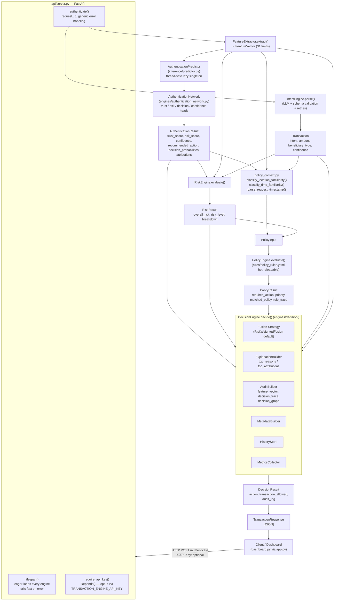

# 🧠 NeuralAuth

<div align="center">

### AI-Powered Multi-Modal Transaction Authentication Engine

*Explainable, policy-aware, production-hardened transaction authentication.*


</div>

---

## Table of Contents

1. [Overview](#overview)
2. [Key Features](#key-features)
3. [Complete Architecture Graph](#complete-architecture-graph)
4. [Request Lifecycle, Step by Step](#request-lifecycle-step-by-step)
5. [Startup & Shutdown Lifecycle](#startup--shutdown-lifecycle)
6. [Core Components](#core-components)
7. [Decision Engine Internals](#decision-engine-internals)
8. [Repository Structure](#repository-structure)
9. [Module Dependency Graph](#module-dependency-graph)
10. [Getting Started](#getting-started)
11. [Configuration](#configuration)
12. [Security](#security)
13. [Testing](#testing)
14. [Milestones](#milestones)
15. [Tech Stack](#tech-stack)
16. [Known Limitations & Roadmap](#known-limitations--roadmap)
17. [Contributing](#contributing)
18. [License](#license)

---

## Overview

**NeuralAuth** authenticates financial transactions in real time by combining a multi-task deep neural network, an LLM-backed intent parser, a deterministic risk engine, a YAML-driven policy engine, and a pluggable decision-fusion layer — all behind a single FastAPI endpoint.

Every stage produces a typed, explainable output that is threaded through to a full audit trail: the exact feature values that fed the model, the model's own attribution scores, which policy rules matched, and which fusion strategy produced the final action. Nothing is a black box.

---

## Key Features

- 🧠 Multi-task deep neural Authentication Network (trust / risk / decision / confidence heads)
- 🎙 Voice biometrics + behavioral signal ingestion
- 🚗 Vehicle/location/time context analysis
- 🤖 LLM-backed Intent Engine (schema-validated, retrying, constrained decoding when available)
- ⚠️ Deterministic, YAML-driven Policy Engine (hot-reloadable rules, no code changes to add a rule)
- ⚖️ Pluggable Decision Fusion (majority/weighted/Bayesian/risk-first/policy-first strategies)
- 🔍 Full, explainable audit trail — every engineered feature, every model attribution, every matched rule, every fusion vote
- ⚡ FastAPI backend with **eager startup model loading** (no first-request latency) and **fail-fast startup** (won't serve traffic with a broken model)
- 🔒 Thread-safe singleton engines (double-checked locking — guaranteed single model load under concurrency)
- 🛡 Opt-in API-key authentication, input validation (GPS bounds, non-negative speed, ISO-8601 timestamps, non-blank identifiers), and no internal-exception leakage to clients
- 🧪 158 automated tests across unit / integration / concurrency / security / validation layers
- 📈 End-to-end offline training pipeline with synthetic dataset generation

---

## Complete Architecture Graph

### High-level system view



### Full layered view (text form)

```text
┌──────────────────────────────────────────────────────────────────────────┐
│                              CLIENT LAYER                                │
│   dashboard.py (NiceGUI UI)  ──launched by──>  app.py                    │
│   OR any direct HTTP caller (curl, service-to-service, etc.)             │
└───────────────────────────────────┬────────────────────────────────────┘
                                     │  POST /authenticate
                                     │  [X-API-Key header, optional]
                                     ▼
┌──────────────────────────────────────────────────────────────────────────┐
│                      api/server.py  (FastAPI application)                │
│                                                                          │
│  lifespan()  ── eager-loads every engine at process startup ──         │
│      • get_predictor()        (AuthenticationPredictor)                 │
│      • get_intent_engine()    (IntentEngine, loads LLM)                 │
│      • get_risk_engine()      (RiskEngine)                              │
│      • get_policy_engine()    (PolicyEngine, loads rules YAML)          │
│      • get_decision_engine()  (DecisionEngine)                         │
│      Any failure ⇒ startup aborts, process never serves traffic.        │
│      Each getter is double-checked-locked (threading.Lock) so           │
│      concurrent callers can never construct >1 instance.                │
│                                                                          │
│  require_api_key()  ── Depends() on POST /authenticate ──               │
│      off by default; enforced when TRANSACTION_ENGINE_API_KEY is set    │
│                                                                          │
│  authenticate(request: TransactionRequest)                              │
│      • Pydantic validation (GPS bounds, non-negative speed,             │
│        non-blank user_id/transcript, ISO-8601 timestamp) → 422          │
│      • request_id generated for correlation                            │
│      • unhandled exceptions → generic message + request_id to client,   │
│        full stack trace logged server-side only                        │
└───────────────────────────────────┬────────────────────────────────────┘
                                     ▼
┌──────────────────────────────────────────────────────────────────────────┐
│  1. FEATURE EXTRACTION   engines/feature_extractor.py                    │
│     raw request dict ──► FeatureVector (models/feature_vector.py)        │
│     31 fields: identity(5) + biometrics(4) + behavior(5) + vehicle(6)    │
│               + history(4) + transaction(4) + intent(2) + risk(1)        │
└───────────────────────────────────┬────────────────────────────────────┘
                                     ▼
┌──────────────────────────────────────────────────────────────────────────┐
│  2. AUTHENTICATION NETWORK   inference/predictor.py                      │
│     AuthenticationPredictor (thread-safe lazy singleton)                 │
│       • loads + cross-validates: checkpoint (.pth), scaler (.pkl),       │
│         encoder (.pkl), feature_columns.json, model_info.json,          │
│         class_mapping.json                                              │
│       • preprocess() → tensor → AuthenticationNetwork (forward pass)     │
│       • Prediction.to_result() → AuthenticationResult                   │
│                                                                          │
│     engines/authentication_network.py                                   │
│       FeatureVector ─► FeatureAttention ─► ProjectionLayer               │
│                     ─► ResidualEncoder ─► Shared Embedding               │
│                     ├─► Trust Head        (trust_score)                 │
│                     ├─► Risk Head         (risk_score)                  │
│                     ├─► Decision Head     (decision_probabilities)      │
│                     └─► Confidence Head   (confidence, confidence_std)   │
│     Output: AuthenticationResult(trust_score, risk_score, confidence,    │
│             recommended_action, decision_probabilities, attributions)   │
└───────────────────────────────────┬────────────────────────────────────┘
                                     ▼
┌──────────────────────────────────────────────────────────────────────────┐
│  3. INTENT ENGINE   engines/intent_engine.py                             │
│     transcript ──► LLM (config-selected LIGHT/HEAVY backend)             │
│         ──► schema validation ──► retry-on-failure (max_retries)         │
│         ──► beneficiary SAVED/NEW/UNKNOWN classification                 │
│     Output: Transaction(intent, amount, beneficiary_type, confidence)   │
└───────────────────────────────────┬────────────────────────────────────┘
                                     ▼
┌──────────────────────────────────────────────────────────────────────────┐
│  4. RISK ENGINE   engines/risk_engine.py                                 │
│     Does NOT compute risk itself — standardizes the Authentication       │
│     Network's risk_score into a typed contract + auditable breakdown:    │
│       overall_risk, risk_level (LOW/MEDIUM/HIGH/CRITICAL), confidence,   │
│       breakdown{voice_risk, behavior_risk, location_risk,                │
│                  device_risk, transaction_risk}                         │
│     Deliberately produces NO recommended action — risk assesses,        │
│     Decision Fusion (stage 6) is the only place risk becomes a verdict. │
└───────────────────────────────────┬────────────────────────────────────┘
                                     ▼
┌──────────────────────────────────────────────────────────────────────────┐
│  5. POLICY ENGINE   engines/policy_engine.py + policy_context.py         │
│     policy_context.py translates continuous FeatureVector scores into    │
│     the categorical labels the rules key off of:                        │
│       classify_location_familiarity(score) → FAMILIAR | UNFAMILIAR       │
│       classify_time_familiarity(score, ts) → NORMAL | ODD_HOUR           │
│     PolicyInput{trust_score, risk_score, confidence, network_decision,   │
│       intent, intent_confidence, risk_level, transaction_amount,         │
│       beneficiary_type, location_familiarity, time_familiarity,          │
│       previous_trust_score, failed_attempts}                            │
│                     │                                                   │
│                     ▼  evaluated against rules/policy_rules.yaml         │
│     11 hot-reloadable rules (priority-ordered, e.g. RejectCriticalRisk,  │
│     ManualReviewRepeatedFailures, UnfamiliarLocation, OddHourActivity,   │
│     NewBeneficiary, LargeTransaction, ...) — falls back to an in-code    │
│     default ruleset only if the YAML file is missing.                   │
│     Output: PolicyResult(required_action, priority, matched_policy,      │
│                           rule_trace, policy_score)                     │
└───────────────────────────────────┬────────────────────────────────────┘
                                     ▼
┌──────────────────────────────────────────────────────────────────────────┐
│  6. DECISION ENGINE   engines/decision/  (see full internals below)      │
│     Fuses AI recommendation + Policy recommendation (+ any extra         │
│     recommenders) into ONE explainable, audited final action.           │
│     Output: DecisionResult(action, transaction_allowed,                 │
│                             authentication_required, voice_required,    │
│                             otp_required, manual_review, audit_log)      │
└───────────────────────────────────┬────────────────────────────────────┘
                                     ▼
┌──────────────────────────────────────────────────────────────────────────┐
│  7. API RESPONSE   models/response.py :: TransactionResponse             │
│     status, action, transaction_allowed, authentication_required,       │
│     voice_required, otp_required, manual_review, message, reason,       │
│     audit_log { metadata, decision_trace, decision_graph, top_reasons,   │
│                 top_attributions, feature_vector (all 31 fields),        │
│                 timeline_ms, decision_history, transaction }             │
└──────────────────────────────────────────────────────────────────────────┘
```

---

## Request Lifecycle, Step by Step

1. `POST /authenticate` arrives with a `TransactionRequest` JSON body.
2. **Validation** — Pydantic rejects blank `user_id`/`transcript`, out-of-range GPS coordinates, negative speed, or malformed timestamps with a `422` before any engine runs.
3. **Auth gate** — if `TRANSACTION_ENGINE_API_KEY` is configured, the `X-API-Key` header must match, or the request is rejected with `401`.
4. **Feature Extraction** builds the 31-field `FeatureVector`.
5. **Authentication Network** (via the pre-warmed `AuthenticationPredictor`) produces trust/risk/confidence/decision-probability signals.
6. **Intent Engine** parses the voice transcript into a structured `Transaction`.
7. **Risk Engine** turns the network's risk score into a leveled, explainable assessment.
8. **Policy Engine** evaluates deterministic YAML rules against everything gathered so far — including real, request-derived `location_familiarity`, `time_familiarity`, `previous_trust_score`, and `failed_attempts` (not hardcoded placeholders).
9. **Decision Engine** fuses the AI and Policy recommendations (Policy's `CRITICAL` priority unconditionally wins), builds the full audit trail (including the complete `feature_vector`), and returns one final action.
10. **Response** is serialized back to the client; any unhandled exception at any stage is caught once, logged in full server-side, and returned to the client only as a generic message + `request_id`.

---

## Startup & Shutdown Lifecycle

```text
process start
     │
     ▼
FastAPI lifespan() enters
     │
     ├─► get_predictor()        ─┐
     ├─► get_intent_engine()     │  each call is guarded by its own
     ├─► get_risk_engine()       │  threading.Lock with double-checked
     ├─► get_policy_engine()     │  locking — safe even if hit concurrently
     └─► get_decision_engine()  ─┘
     │
     ├─► any loader raises  ──►  logged CRITICAL, exception re-raised
     │                            ──►  uvicorn/TestClient never finish
     │                            starting — the process never serves
     │                            traffic with a partially-loaded model.
     │
     ▼
"Startup complete: all engines are warm." (logged)
     │
     ▼
server accepts traffic — every request reuses the same 5 warm singletons,
so the first real request pays ~0ms of model-loading cost (verified:
~4.7s startup, ~4ms first request, in a real run with all real models).
     │
     ▼
shutdown ──► lifespan() resumes after yield ──► "Shutdown complete." (logged)
```

---

## Core Components

### Authentication Network (`engines/authentication_network.py`)

The central model. `FeatureVector → FeatureAttention → ProjectionLayer → ResidualEncoder → shared embedding → {Trust, Risk, Decision, Confidence} heads`. Also hosts the training loop, checkpoint I/O, an `ExperimentLogger`, MC-dropout uncertainty utilities, and a `DeepEnsemble` — see [Known Limitations](#known-limitations--roadmap) for why this file is flagged as a future decomposition candidate.

### Feature Extraction (`engines/feature_extractor.py`, `models/feature_vector.py`)

Deterministic, ML-free transformation of a raw request into the 31-field `FeatureVector`. No scoring, no normalization, no tensor conversion — that's the inference layer's job.

### Inference (`inference/predictor.py`)

`AuthenticationPredictor` loads and cross-validates six on-disk artifacts once, then exposes `preprocess()` / `predict()` / `predict_result()` as three explicitly separate steps. Thread-safe lazy singleton via `get_predictor()`.

### Intent Engine (`engines/intent_engine.py`)

Wraps an LLM (HF pipeline, LIGHT/HEAVY backend selectable via `config/intent/config.yaml`) with prompt construction, JSON-schema validation, retry-on-failure, and beneficiary SAVED/NEW/UNKNOWN classification.

### Risk Engine (`engines/risk_engine.py`)

Standardizes the network's risk score into `overall_risk`, `risk_level`, and an auditable `breakdown` — deliberately produces no recommended action of its own.

### Policy Context (`engines/policy_context.py`)

Bridges continuous `FeatureVector` scores (`location_familiarity`, `time_familiarity`) into the categorical labels the Policy Engine's rules key off of, with documented, configurable thresholds and an optional wall-clock "odd hour" signal.

### Policy Engine (`engines/policy_engine.py`, `rules/policy_rules.yaml`)

Deterministic, hot-reloadable, YAML-driven rule evaluation. Every rule is a declarative `when: {field_op: value}` block; conflicts resolve by priority then action severity.

### Decision Engine (`engines/decision/`)

See [Decision Engine Internals](#decision-engine-internals) below — this is a package, not a single file, by design.

### Dashboard (`dashboard.py`, launched by `app.py`)

A NiceGUI-based visualization client that talks to the API exclusively over HTTP, rendering the pipeline stages, risk/policy/fusion breakdowns, the full feature vector, and system telemetry.

---

## Decision Engine Internals

`engines/decision/` is a package, each module with exactly one responsibility:

```text
engines/decision/
├── decision_engine.py   DecisionEngine — orchestration only, calls everything below in order
├── config.py            DecisionConfig — thresholds, source weights, externalizable via YAML
├── fusion.py             Pluggable strategies (all implement DecisionFusionStrategy):
│                           MajorityVoting · WeightedVoting · RiskWeightedFusion (default)
│                           · BayesianFusion · RiskFirst · PolicyFirst
├── explanation.py        ExplanationBuilder — top_reasons() / top_contributors() (model attributions)
├── audit.py              AuditBuilder — decision_trace, decision_graph, feature_vector, rule_trace
├── metadata.py           MetadataBuilder — request_id / decision_trace_id / model & policy versions
├── history.py            HistoryStore (InMemoryHistoryStore default) — per-user recent-action recall
├── metrics.py             MetricsCollector — decision counters for monitoring
├── hooks.py               HookRegistry — before/after_fusion, before/after_audit extension points
├── ensemble.py            combine_ensemble_predictions — merges multiple AuthenticationResults
├── numeric.py             to_python() — safe tensor → plain-Python conversion
├── serializers.py         to_json()
└── types.py               DecisionAction, DecisionResult, PolicyPriority, Severity
```

`DecisionEngine.decide(authentication, risk, policy, intent=None, transaction=None, features=None, ...)` fuses the AI vote and the Policy vote (plus any `additional_recommendations`) via the configured strategy, builds `top_reasons` and `top_attributions` (the model's own top-5 attribution/attention scores — **not** the feature vector), and assembles the full audit trail — including, since the most recent fix, the complete 31-field `feature_vector` under `audit_log["feature_vector"]`, so dashboards can inspect every engineered signal, not just the top-5 model attributions.

---

## Repository Structure

```text
Transaction_engine/
│
├── api/
│   └── server.py                 FastAPI app: lifespan, auth dependency, /authenticate route
│
├── engines/
│   ├── authentication_network.py Model architecture + training loop + checkpoint I/O
│   ├── feature_extractor.py      Raw request → FeatureVector (31 fields)
│   ├── intent_engine.py          LLM-backed transcript → Transaction
│   ├── risk_engine.py            Risk standardization + breakdown
│   ├── policy_engine.py          YAML-driven deterministic rules
│   ├── policy_context.py         FeatureVector scores → policy categorical labels
│   └── decision/                 Fusion, audit, explanation, metadata, history, metrics, hooks
│
├── inference/
│   └── predictor.py               AuthenticationPredictor (artifact loading + inference)
│
├── models/
│   ├── request.py                 TransactionRequest (validated Pydantic model)
│   ├── response.py                TransactionResponse
│   ├── feature_vector.py          FeatureVector dataclass (31 fields)
│   └── prediction.py              Prediction / AuthenticationResult contracts
│
├── config/
│   ├── auth/config.yaml           Authentication Network hyperparameters
│   └── intent/config.py+.yaml     Intent Engine config (LIGHT/HEAVY backend selection)
│
├── rules/
│   └── policy_rules.yaml          Live, hot-reloadable Policy Engine rules
│
├── training/                       Independent offline pipeline: dataset generation,
│                                    LLM-based labeling/verification, train.py, evaluate.py
│
├── scripts/
│   └── smoke_test_qwen.py          Manual model smoke test (not a pytest test)
│
├── tests/                           158 tests: unit, integration, concurrency, security, validation
│
├── dashboard.py                    NiceGUI visualization client (HTTP-only, no business logic)
├── app.py                          Launches API (background thread) + dashboard together
├── .env.example                    Documented environment variables (no real secrets)
├── .gitignore                      Excludes secrets, caches, venvs, model artifacts
├── requirements.txt
└── README.md
```

---

## Module Dependency Graph

Verified to be a clean DAG — no circular imports anywhere in the runtime path:

```text
models/  ◄──  config/   (independent leaves)
   ▲             ▲
   │             │
   └──── engines/ ────┘
            ▲
            │
      inference/
            ▲
            │
          api/
```

- `api/server.py` → `models.*`, `engines.*`, `inference.predictor`
- `inference/predictor.py` → `engines.authentication_network`, `engines.feature_extractor`
- `engines/feature_extractor.py` → `models.feature_vector`
- `engines/intent_engine.py` → `config.intent.config`
- Nothing under `engines/`, `models/`, or `config/` imports from `api/` or `inference/` — the business/ML layer has zero knowledge of the web layer (correct dependency inversion).

---

## Getting Started

```bash
# 1. Create and activate a virtual environment
python3 -m venv .venv
source .venv/bin/activate

# 2. Install dependencies
pip install -r requirements.txt

# 3. Configure environment (optional — only needed for the LLM-based
#    training/labeling pipeline, and for enabling API-key auth)
cp .env.example .env
# edit .env with real values

# 4. Run the API standalone
python api/server.py
# → serves on http://127.0.0.1:8000 (GET /, GET /health, POST /authenticate)

# 5. OR run the API + dashboard together
python app.py
```

`api/server.py`'s FastAPI `lifespan` loads every model/engine before the server starts accepting traffic — expect a multi-second startup (dominated by the Authentication Network checkpoint and the Intent Engine's LLM) rather than a slow first request.

---

## Configuration

| File | Loaded by | Purpose |
|---|---|---|
| `config/auth/config.yaml` | `ModelConfig.from_yaml()` (`engines/authentication_network.py`) | Authentication Network architecture/training hyperparameters |
| `config/intent/config.yaml` | `load_config()` (`config/intent/config.py`) | Intent Engine backend selection (LIGHT/HEAVY model), retries, validation limits |
| `rules/policy_rules.yaml` | `PolicyEngine.load_rules()` | Live, hot-reloadable Policy Engine rules (`reload_yaml()` to pick up changes without a restart) |
| `.env` (from `.env.example`) | `training/config.py` (dotenv) | LLM provider API key for the offline training/labeling pipeline; `TRANSACTION_ENGINE_API_KEY` to enable API auth |

---

## Security

- **Authentication**: `POST /authenticate` is gated by an opt-in `X-API-Key` header check (`require_api_key`, `api/server.py`), enforced only when `TRANSACTION_ENGINE_API_KEY` is set. A startup warning is logged if it's left unset. `GET /` and `GET /health` are always open (health-check friendly).
- **No internal detail leakage**: unhandled exceptions are logged in full server-side (`logger.exception`) and returned to clients only as a generic message plus an opaque `request_id` for support correlation — never `str(exception)`.
- **Input validation**: GPS coordinates constrained to valid ranges, `vehicle_speed` non-negative, `user_id`/`transcript` rejected if blank, `timestamp` must be ISO-8601 — malformed input fails cleanly with `422` instead of crashing deep inside the pipeline.
- **Secrets hygiene**: `.gitignore` excludes `.env`, model artifacts, and caches; `.env.example` documents required variables without real values.
- **Safe deserialization practices**: all YAML loading uses `yaml.safe_load`; no `eval`/`exec`/`subprocess`/`shell=True` anywhere in the codebase.
- **Thread-safe model loading**: every lazy singleton (`get_predictor`, `get_intent_engine`, `get_risk_engine`, `get_policy_engine`, `get_decision_engine`) uses double-checked locking — verified under a 32-thread concurrency test that exactly one instance is ever constructed.

See [Known Limitations & Roadmap](#known-limitations--roadmap) for security items that are identified but intentionally deferred (PII redaction in `audit_log`, `torch.load`/`joblib.load` hardening, rate limiting).

---

## Testing

```bash
pytest                 # full suite — 158 tests, ~25-30s
pytest tests/test_concurrency.py -v      # thread-safety of every singleton
pytest tests/test_startup.py -v          # FastAPI lifespan behavior
pytest tests/test_api_security.py -v     # auth + error-leakage behavior
pytest tests/test_request_validation.py -v  # input validation
```

| Category | Example files |
|---|---|
| Unit | `test_feature_extractor.py`, `test_policy.py`, `test_policy_context.py`, `test_network.py`, `test_intent.py`, `test_intent_engine.py` |
| Integration | `test_pipeline_integration.py`, `test_api.py`, `test_dashboard_feature_vector.py` |
| Concurrency | `test_concurrency.py` |
| Startup/Lifecycle | `test_startup.py` |
| Security | `test_api_security.py` |
| Validation | `test_request_validation.py` |

All tests run against the real engines wherever practical (e.g. `test_pipeline_integration.py`, `test_dashboard_feature_vector.py`), with only the model-loading seams (`get_predictor`, `get_intent_engine`, etc.) monkeypatched where a real model would be too slow/unnecessary for the behavior under test.

---

## Milestones

| Milestone | Status |
|------------|--------|
| M0 – Foundation | ✅ |
| M1 – Feature Extraction | ✅ |
| M2 – Authentication Network | ✅ |
| M3 – Training Pipeline | ✅ |
| M4 – Intent Engine | ✅ |
| M5 – Risk Engine | ✅ |
| M6 – Policy Engine | ✅ |
| M7 – Decision Engine v1 | ✅ |
| M8 – Enterprise Decision Package | ✅ |
| M9 – Decision Fusion | ✅ |
| M10 – End-to-End Pipeline | ✅ |
| M11 – Explainability (full audit trail, feature vector, attributions) | ✅ |
| M12 – Startup Lifecycle & Thread Safety | ✅ |
| M13 – Security Hardening (auth, validation, error handling) | ✅ |
| M14 – Testing & Validation (158 automated tests) | ✅ |
| M15 – Explainability Dashboard | 🚧 |
| M16 – Monitoring & Analytics (drift detection, live metrics) | ⏳ |
| M17 – PII Redaction in Audit Trail | ⏳ |
| M18 – Rate Limiting | ⏳ |
| M19 – Deployment (Docker / Kubernetes / CI/CD) | ⏳ |

---

## Tech Stack

- Python 3.11+
- PyTorch
- FastAPI + Uvicorn + Pydantic v2
- NumPy / Pandas / Scikit-Learn
- Transformers (HF pipeline for the Intent Engine)
- ONNX / ONNX Runtime
- PyYAML
- NiceGUI (dashboard)
- pytest

---

## Known Limitations & Roadmap

Identified during the most recent architecture/security review, tracked deliberately rather than fixed speculatively:

- **PII in audit trail** — `audit_log["transaction"]` currently includes the raw request (transcript, GPS, user_id) unredacted. Needs a coordinated redaction/allow-list design with the dashboard, not an isolated patch.
- **`torch.load`/`joblib.load` use `weights_only=False`** on local model artifacts — acceptable only as long as the artifact directory is protected from tampering; migrating to `weights_only=True` requires verifying the checkpoint's bundled `config` object against the actual production checkpoint format first.
- **No rate limiting** on `/authenticate` — a single endpoint runs the full ML pipeline; nothing currently prevents request-flooding.
- **Two large, multi-concern modules** — `engines/authentication_network.py` (architecture + training loop + checkpointing) and `engines/intent_engine.py` (LLM driving + validation/normalization) are flagged for a dedicated, test-first decomposition, not an incidental refactor.
- **Config loading is inconsistent** across `config/intent`, `engines/authentication_network.ModelConfig`, `engines/decision/config.py`, and `engines/policy_engine.py` — four different loading philosophies; worth unifying once a second real YAML-driven `DecisionConfig` consumer exists.
- **Dependency versions are unpinned** in `requirements.txt` — flagged for a proper `pip-compile`-style resolution pass.

---

## Contributing

1. Fork the repository
2. Create a feature branch
3. Add/update tests for your change (`pytest` must stay green)
4. Commit your changes
5. Open a Pull Request

---

## License

This project is released under the MIT License.

---

<div align="center">

## NeuralAuth

### Intelligent Authentication Through Deep Learning

**Secure • Explainable • Adaptive**

</div>
